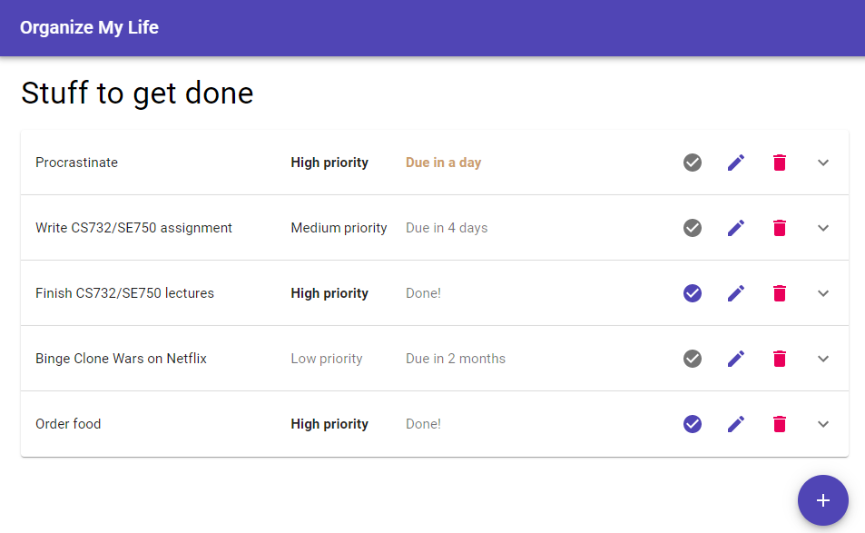

# CS 732 / SE 750 Assignment Two - Extending the Todo App
In this assignment, you'll write tests for, and modify, the functionality of the to-do app originally introduced in the `lecture-08-examples` project. The assignment will give you further practice with React, Redux, MongoDB

## Environment setup
To run the code for this assignment, make sure you have the following installed on your machine:

- [Node.js](https://nodejs.org/en/) 12 or higher (earlier versions may work but support is not guaranteed)

- npm (should come with node.js so you don't need to install it separately)

- [MongoDB community server](https://www.mongodb.com/download-center/community), and (optionally) [Compass](https://www.mongodb.com/products/compass)

  - If you'd rather use an [Atlas cloud MongoDB instance](https://www.mongodb.com/cloud/atlas) instead of installing community server on your dev machine, you're welcome to do so. In this case, remember to appropriately modify `server/server.js` to change the connection string.

- A text editor of choice ([VS code](https://code.visualstudio.com/) recommended)

Once you've gotten everything installed, test by running the following commands from a terminal:

```
npm --version
npx --version
node --version
```

All three should give you back a version number (12.x or higher for node, 6.x or higher for npm and npx). Then, open MongoDB Compass and make sure you can connect to your MongoDB community server instance (or Atlas cloud instance if you've chosen to go that route).


## Project setup
Next, setup the project by opening a terminal in the `server` directory and running `npm install`. Then, do the same in the `client` directory.

**Note: Other than Exercise Five,** All packages necessary for this project have already been added to their respective `package.json` files, and all configs such as `babel.config.js` have been setup correctly. Therefore, you aren't required to install any additional packages (though you are welcome to - especially for Exercise Five).

After the npm installs have run, next run `npm start` in the `server` directory. The Express server should display the following:

```
App server listening on port 10000!
Connected to database!
```

Once these messages are displayed, you'll need to initialize the database with some dummy data (unless you've already run the `lecture-08-examples` project). This can be achieved by browsing to <http://localhost:10000/api/init> in your browser of choice. Browsing to this endpoint at any time will clear the database, and re-initialize it with data that can be found in `server/db/dummy-data.js`. You'll know the command has worked because you'll see a bunch of JSON data displayed in the browser.

Once you've created your dummy data, run `npm start` in the `client` directory. Your default web browser should display <http://localhost:3000/>, which should look similar to the following:



*Figure One: Starting point for this assignment*

Now, you're ready to go!

**Remember:** If you make edits to the client, you should be able to see your changes live in the browser. If you make edits to the server however, you'll need to stop and restart it for your changes to take effect. You shouldn't need to stop and restart the client at the same time.


## Marking
You will be given a letter grade for this assignment. Grading is as follows:

- **A+:**
  - All functionality is implemented for all exercises
  - Bug-free as determined by marker
  - UI layout is clean and responsive
  - All written explanations are clear and sufficiently detailed

- **A:**
  - All functionality is implemented for all exercises
  - One or two minor bugs maximum as determined by marker
  - UI layout is clean and responsive
  - All written explanations are clear with most detail covered

- **B:**
  - Most functionality implemented (one incomplete exercise at maximum)
  - One or two minor bugs max for implemented exercises as determined by marker
  - UI layout for implemented exercises is clean
  - Written explanations for implemented exercises are clear with most detail covered

- **C:** 
  - Some functionality implemented (two incomplete exercises at maximum)
  - Up to three moderate bugs max for implemented exercises as determined by marker
  - UI for implemented exercises is usable (as determined by marker)
  - Written explanations for implemented exercises contain some detail but may be lacking in depth

- **D:** 
  - More than two incomplete exercises; or
  - More than three moderate bugs as determined by marker; or
  - UI cannot be understood by marker; or
  - No written explanations provided; or written implementations lack any reasonable detail; or
  - `node_modules` folders are included with your submission


## Submission instructions
When you're ready to submit, upload a single Zip file to Canvas containing your solution. **DO NOT UPLOAD YOUR `node_modules` FOLDERS! If you do, you will automatically receive a D grade for your assignment, as noted in the marking criteria above**.


## Exercise One: Testing
To begin, let's write a few unit tests for the existing codebase. You don't need to test everything, just the following:

1. Add two more "display" tests for `TodoExpansionPanel`. You'll see a unit test which makes sure the panel displays the correct info when an overdue todo item is supplied. Write two more tests to check that incomplete and complete items also result in the correct information being displayed.

2. Add event handler tests for `TodoExpansionPanel`. There are three buttons on the panel: one each for toggling completed status, editing, and deletion. Write three more unit tests: on each to check whether the panel fires the correct event when each of these buttons are clicked.

   **Hint:** `screen.getByTitle()` can be used to get a reference to one of the buttons based on its title text (the text that's visible when the user mouses over the button).

3. Add *shallow* tests for `ToDoList`. Write three such tests:
   - Does the list render correctly when supplied with an empty todo list? That is, does it simply render a `<div>`, and nothing else?
   - Does the list render correctly when supplied with a todo list with one item? That is, does it render a `TodoExpansionPanel` whose `todo` prop has been set to that item?
   - Does the list render correctly when supplied with a todo list with more than one item? That is, does it render the correct `TodoExpansionPanel`s in the correct order?

   **Hint:** The `shallow()` wrapper's `find()` function can find particular react components, e.g. `find(TodoExpansionPanel)`. If you have a reference to a specific react component, you can access its properties via `props`. For more information on shallow rendering, check out [its documentation](https://enzymejs.github.io/enzyme/docs/api/shallow.html).


## Exercise Two: Sorting todo items
Next, we'll extend the functionality of the webapp by allowing users to sort through their todo items.

Add new functionality to your app to allow this sorting to occur. The functional requirements for this process are as follows:

1. Users must be able to sort by *title*, *created date*, or *due date* (or choose not to sort).

2. Sort direction can be *ascending* (A - Z for the title, or earliest-to-latest for the dates) or *descending* (the reverse of ascending).

3. The user's chosen sorting options should be preserved across page refreshes &amp; reloads, but need not be preserved when accessing on different devices (i.e. nothing needs to be saved to the server).

4. If a new todo item is added while the list is sorted, it should appear in the appropriate position (**hint:** you shouldn't need to specifically write code to handle this, depending on your implementation of requirements 1 through 3).

Other than these three requirements, you may implement this functionality however you choose.

An example of how this might look is given in the following screenshots (but there is no particular requirement regarding UI layout - that's up to you):


*Figure Two: Possible sorting controls, with no sort applied*


*Figure Three: Possible dropdown menu showing different sorting options*


*Figure Four: Todo list, sorted by title in ascending order*

Once you've implemented the functionality for this exercises, if your unit test fail, modify them so that they pass.

Finally, in the space below, briefly describe how you have implemented this new functionality. What new React components have you developed, if any? How do they fit into the rest of the app? How does the sorting actually work, based on provided options? Did you need to modify any other code, other than React components? Most importantly, *why* did you choose to do it this way?

```
After analyse exercise 2,3,4,5, to implete those, I combine exercise 2,3,4,5 as one component(todo-config.js). 
For the sorting and direction, in order to apply the change the state between todo-config and list, it needs setState in todo-manage(the up level of them) to achieve it. 
In the meantime to implete the function of sorting, I imported loash lib to sort and direct the value.

```


## Exercise Three: Grouping todo items
In this exercise, we'll extend the functionality we implemented in the previous exercise by adding the ability to *group* items as well as sort them. The requirements are as follows:

1. Items must be able to be grouped by *priority* or *due date* (or have no grouping applied).

   - When grouped by priority, *high* priority items should be displayed first; then *medium*; then *low*.

   - When grouped by due date, any *overdue* items should be displayed first; then any items due in two days or less; then any other items.

2. Each group should have a heading (e.g. "High priority", "Medium priority", and "Low priority" when grouping by priority).

3. If no grouping is selected, no additional headings should be displayed (i.e. the list should look as it does in Figures One through Four).

4. Sorting and grouping should be able to be applied at the same time. If a sort and a grouping are both applied at once, items should be sorted according to sorting preferences, within their groups.

5. New todo items added while groupings are in place should appear in their correct groups.

6. As with sorting, any grouping preferences specified by the user should persist across page reloads / refreshes.

An example of what groupings might look like can be seen in the following screenshot:


*Figure Five: Grouping by due date*

As with Exercise Two, write a description here of what additions you have made to the app to accomplish this functionality, and why:

```
As mentioned in execise 2, 
In order to apply the change the state between todo-config and list, it needs setState in todo-manage(the up level of them) to achieve it. 
Create a new component (todo-group.js) to store the new grouped result and display
The logic function impletementation is impletement in todo-list.js
```


## Exercise Four: Extending the sorting &amp; grouping functionality
In this exercise, we'll introduce one more requirement to both sorting and grouping:

When sorting and / or grouping, users should have the option to group all completed todo items separately.

- When sorting (without grouping), all completed todo items should be displayed *after* all incomplete todo items. They should have the appropriate sort order applied amongst themselves. An example of what this might look like is given in the following screenshot:


*Figure Six: Sorting items with all completed items grouped at the end of the list*

- When grouping, all completed todo items should be placed in their own group, which will be shown *after* all other groups. An example of what this might look like is given in the following screenshot:


*Figure Seven: Grouping items with all completed items in a separate group*

As seen in these screenshots, this functionality could be implemented as an extra checkbox in the control bar, but there's no specific requirement for this.

As with the previous two exercises, the user's selection must be persisted across page reloads / refreshes.

Finally for this exercise, comment here about what you changed from the previous two exercises to add the new functionality, and why:

```
Your answer here.
```


## (Challenge) Exercise Five: Colors
In this exercise, we'll add the ability to color-code our todo items. Specifically, the requirements are as follows:

1. Each todo item must now have a color. This can be chosen from amongst a predefined set of colors (exactly which set you choose is up to you, but must be at least three colors).

2. On the homepage, each todo's color must be clearly visible.

3. When adding or editing a todo, its color must be able to be selected from the list of predefined colors.

4. In addition to the groupings specified in previous exercises, todos must be able to be grouped by color.

5. A todo item's color should be persisted server-side (i.e. it should be saved to the database along with the rest of the todo item).

Your solution to this exercise will be marked based both on functionality, and also on how well your additions integrate into the rest of the webapp / look "natural".

**Note:** This exercise is deliberately more challenging than the rest of the assignment. The solution may take a while longer to research and implement.

**Hints:** As this is the challenge exercise, there are few hints. However:

- Remember that you'll need to make modifications to both the server-side and client-side code for this exercise

- The [react-color](https://casesandberg.github.io/react-color/) package may be of assistance (though is not required)

As with previous exercises, comment here on how you have implemented your solution to this exercise. Be as detailed as you think is useful for the markers' understanding:

```
Your answer here
```

Examples of how this functionality *might* look when implemented can be seen in the following screenshots - though bear in mind that there are many ways this could be done!


*Figure Eight: Todo list showing a new color icon near the righthand side of each row*


*Figure Nine: Demonstration of a possible color grouping*


*Figure Ten: Example of how color might be displayed within the add / edit dialogs*


*Figure Eleven: One way in which different colors could be selected*
