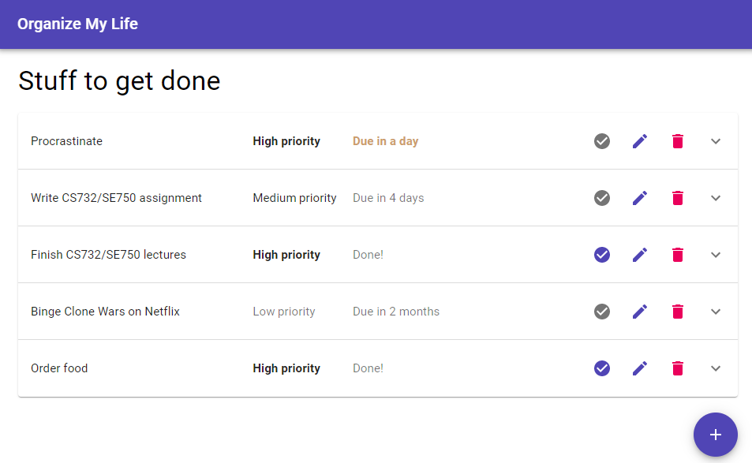

# CS 732 / SE 750 "Lecture" 08 - Test Practice
The questions in these examples will serve as a good example of the kinds of questions you'll get asked in Andrew's section of the upcoming terms test.

As a reminder, you'll have 24 hours to complete the test, of which you should need roughly one hour to complete Andrew's section, and one hour to complete Gerald's section.


## Environment setup
To run these examples, make sure you have the following installed on your machine. You'll need the same setup for the terms test:

- [Node.js](https://nodejs.org/en/) 12 or higher (earlier versions may work but support is not guaranteed)

- npm (should come with node.js so you don't need to install it separately)

- [MongoDB community server](https://www.mongodb.com/download-center/community), and (optionally) [Compass](https://www.mongodb.com/products/compass)

  - If you'd rather use an [Atlas cloud MongoDB instance](https://www.mongodb.com/cloud/atlas) instead of installing community server on your dev machine, you're welcome to do so. In this case, remember to appropriately modify `server/server.js` to change the connection string.

- A text editor of choice ([VS code](https://code.visualstudio.com/) recommended)

Once you've gotten everything installed, test by running the following commands from a terminal:

```
npm --version
npx --version
node --version
```

All three should give you back a version number (12.x or higher for node, 6.x or higher for npm and npx). Then, open MongoDB Compass and make sure you can connect to your MongoDB community server instance (or Atlas cloud instance if you've chosen to go that route).


## Project setup
Next, setup the project by opening a terminal in the `server` directory and running `npm install`. Then, do the same in the `client` directory.

**Note:** All packages necessary for this project have already been added to their respective `package.json` files, and all configs such as `babel.config.js` have been setup correctly. Therefore, you shouldn't need to install any more packages when completing these exercises.

After the npm installs have run, next run `npm start` in the `server` directory. The Express server should display the following:

```
App server listening on port 10000!
Connected to database!
```

Once these messages are displayed, you'll need to initialize the database with some dummy data. This can be achieved by browsing to <http://localhost:10000/api/init> in your browser of choice. Browsing to this endpoint at any time will clear the database, and re-initialize it with data that can be found in `server/db/dummy-data.js`. You'll know the command has worked because you'll see a bunch of JSON data displayed in the browser.

Once you've created your dummy data, run `npm start` in the `client` directory. Your default web browser should display <http://localhost:3000/>, which should look as follows (potentially with different dates / times displayed):



Now, you're ready to go!

**Remember:** If you make edits to the client, you should be able to see your changes live in the browser. If you make edits to the server however, you'll need to stop and restart it for your changes to take effect. You shouldn't need to stop and restart the client at the same time.


## Exercise One: Understanding
For the first step, investigate the existing codebase and make sure you understand what everything is doing. You may also wish to check out [Material UI](https://material-ui.com/), which has been used to provide the styled components for the frontend - though a deep understanding of this should not be required to understand the rest of the project.

## Exercise Two: Completing the "toggle complete" functionality
You'll notice that each todo item in the list has a circular "check" icon. Clicking this icon should allow the user to toggle the complete / incomplete status of the corresponding todo item.

The implementation of this functionality has been started, but not completed. Currently, if the user clicks the button it appears to do nothing - until the user refreshes the page, in which case any toggled items will be updated as expected.

1. What is the problem? What code has not been completed yet? Write your answer here, and be specific:

```
Your answer here.
```

2. Add the missing code to complete your implementation. The "toggle complete" function should now work entirely as intended.


## Exercise Three: Deleting items
Currently, clicking one of the "delete" icons does nothing, other than resulting in `ToDoManager`s `handleDelete()` method being called with the todo item that should be deleted.

For this exercise, complete this functionality. You'll need to:

1. Make an appropriate Redux / thunk action available to the `ToDoManager` in its `props`

2. Dispatch that action from within the `handleDelete()` method

3. Add appropriate reducer functionality to handle the deletion of a todo item from the store

When complete, make sure that a deleted todo item is removed from the list, *and* stays removed when you refresh the page. Remember that you can always reinitialize the database by browsing to <http://localhost:10000/api/init> if you'd like to recover your deleted items.


## Exercise Four: Editing items
You'll notice that clicking one of the "edit" icons causes the page to navigate to `/edit/:id`, where `:id` is the id of the todo item we wish to edit.

Currently, this doesn't change anything on the page. Modify this so that browsing to such a URL instead opens a dialog box for editing an item. Specifically, perform the following steps:

1. Using `react-router-dom`'s `Switch` and `Route` components, adda route to the `ToDoManager` corresponding to an edit

2. Within that route, display a `TodoDetailsDialog` pointing to the correct todo. **Hint:** To access `useParams()` (to get the id), you'll need to wrap this in a function - just calling `useParams()` (or the `withParams()` HOC) within `TodoDetailsDialog` itself won't work.

3. Appropriately handle the `TodoDetailsDialog`'s `onOk` and `onCancel` functions:

   - `onOk` should result in the user being redirected to `/`, and the supplied todo item being saved (by dispatching the appropriate action)

   - `onCancel` should result in the browser navigation history going "back".

   **Hint 1:** Remember all the different values supplied to you using the `withRouter()` HOC, and what they can be used for.

   **Hint 2:** The action to dispatch to update a todo is the same as the one that's dispatched to toggle its completed status.

**Bonus:** For extra credit, further modify the functionality you've just added, so that if the user browses to `/edit/some-id-that-doesn't-exist`, they should be sent "back" in their browser history.


## Exercise Five: Adding new items
For the final exercise, complete the "add" functionality so that when the user clicks the `Fab` (floating action button) at the bottom of the page, they'll be presented with a dialog allowing them to add a new todo item.

Specifically, when the user clicks that button:

1. They should be directed to `/add`

2. This route should also display a `TodoDetailsDialog` but with a custom title, and no todo supplied to begin with

3. If this dialog is cancelled, the user should be sent "back" in the browser history

4. If the dialog is ok'd, the user should be directed to `/`, and an appropriate redux action should be dispatched

5. The "success" of creating a new todo on the server will need to be handled by your Redux reducer, which should result in the new todo appearing on the page.

